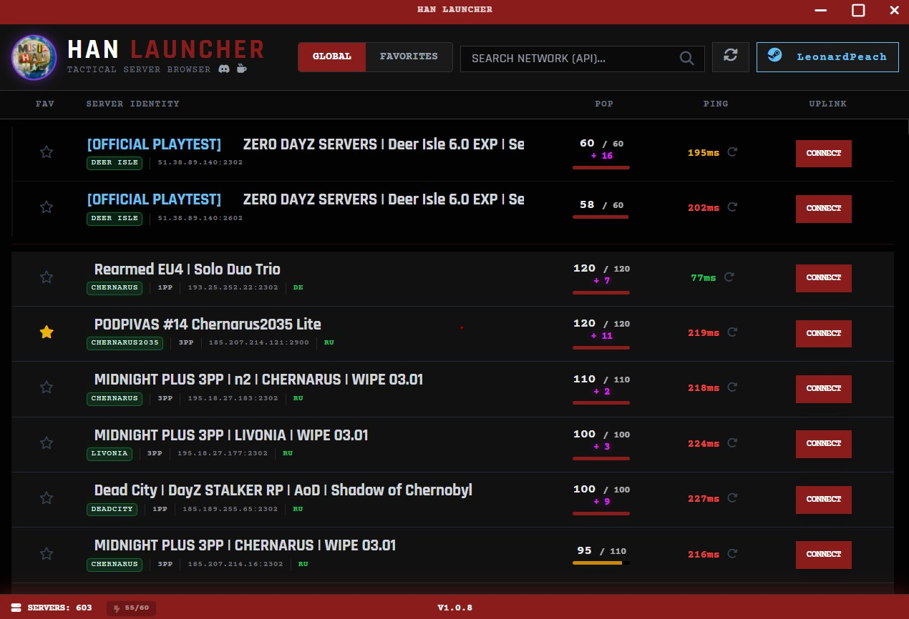
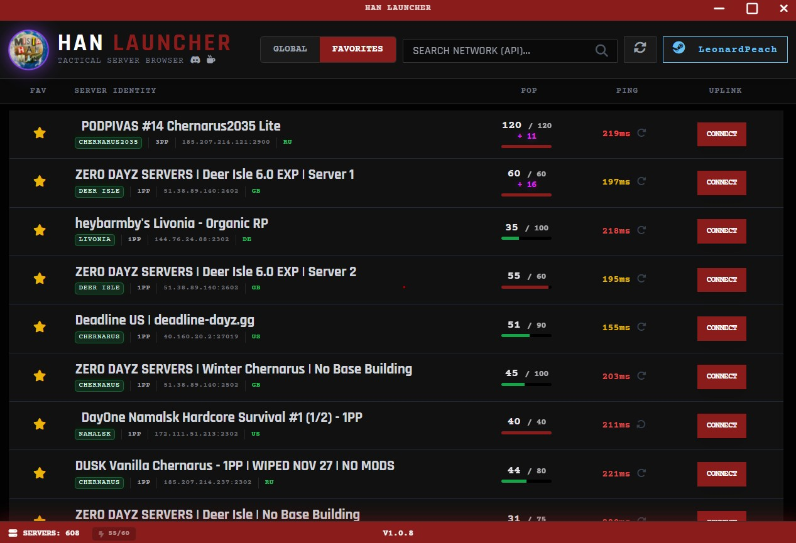
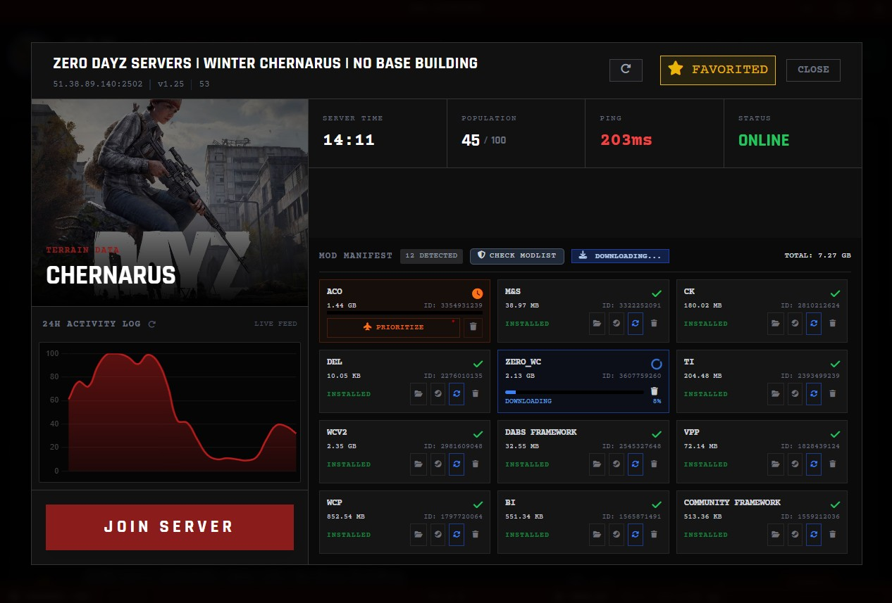
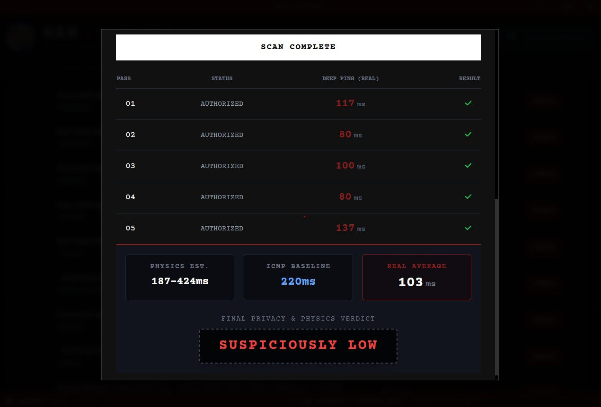
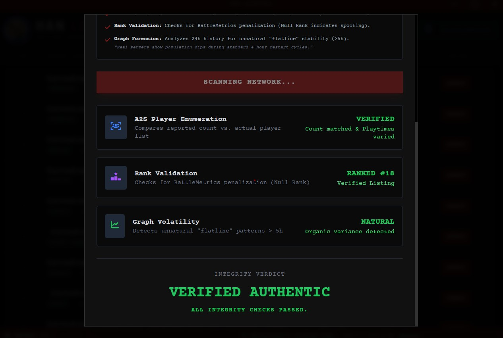

# HAN LAUNCHER

> **Free & Open Source Software**: HAN Launcher is 100% free, open-source, and will **never** contain ads or paid promotions.
> **Open Data Initiative**: Building a DayZ tool? Our playtest and server data JSONs are freely available for the community to use.

A fast and reliable DayZ server launcher built with **Go** and **Wails**. HAN LAUNCHER leverages **native Steamworks bindings** for deep integration, providing a responsive interface with advanced features for server finding and mod management.

  

## 🌟 Features

### 🔍 Server Analysis Tools
-   **Fake Pop Checker**: Check if a server is inflating its player count.
-   **Ping Spoof Detection**: Scan servers to find out if they are faking their ping.
-   **Map Links**: One-click access to the server's map (iZurvive) directly from the browser.

### 🟣 Community Features
-   **Playtest Tracking**: See upcoming map playtests and closed betas easily.

### 🛠️ Mod Management
-   **Steam Integration**: Fully integrated with Steam Workshop.
-   **Auto-Verification**: Automatically detects missing or outdated mods and downloads them for you.
-   **Invalid Mod Detection**: Identifies mods that have been removed from the workshop so you don't get stuck joining.

### ⚡ Performance Options
-   **Custom Launch Parameters**: Add parameters like `-cpuCount=8` and `-exThreads=16` to boost performance.
-   **Better Search**: Improved search to help you find servers with names like `hashima.gg` instantly.

## 🚀 Getting Started

1.  Download the latest executable (`.exe`) from the [Releases](https://github.com/harrychafercook-sys/han-launcher/releases) page.
2.  Run the application.
3.  Set your Survivor Name in the **Identity** settings.
4.  (Optional) Configure your **Launch Parameters** for optimal performance.
5.  Select a server and deploy!

## 📸 Gallery

  
  
    
  
  

## 🤝 Support & Community

Join the operation on Discord or support the development on Ko-fi.

-   [**Discord Community**](https://discord.com/invite/NrygDesgUM)
-   [**Support on Ko-fi**](https://ko-fi.com/harrychafercook)

## 📦 Credits & Dependencies

This project stands on the shoulders of giants. Special thanks to the following open-source projects and services:

### Core Frameworks
-   [**Wails**](https://github.com/wailsapp/wails): The powerful Go framework that makes this lightweight frontend possible.
-   [**PureGo**](https://github.com/ebitengine/purego): Used for low-level library integration (Native Steamworks).

### Libraries
-   [**a2s & a3sb**](https://github.com/woozymasta/a2s): Critical for the ultra-fast native server verification and ping/player checks.
-   [**Rich Go**](https://github.com/hugolgst/rich-go): Powers the real-time Discord status updates.

### Services & Tools
-   [**BattleMetrics API**](https://www.battlemetrics.com/developers/documentation): Provides the extensive server data, search capabilities, and playtest tracking.
-   [**Inno Setup**](https://jrsoftware.org/isinfo.php): The reliable installer technology used to package the launcher.

